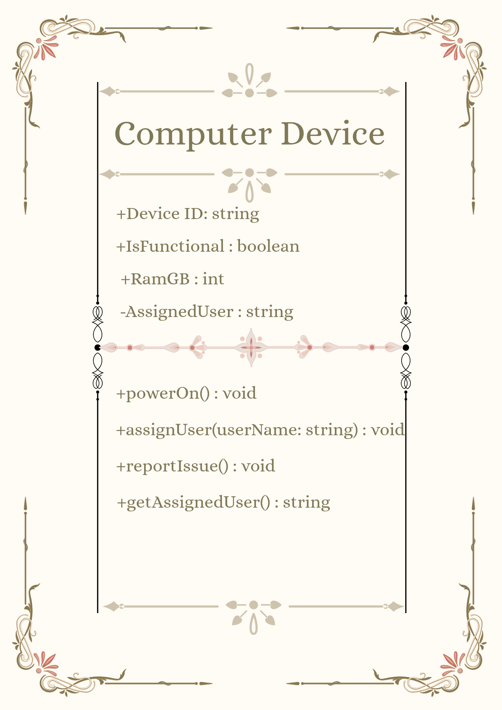
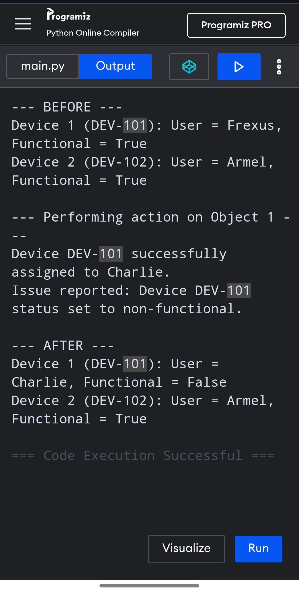
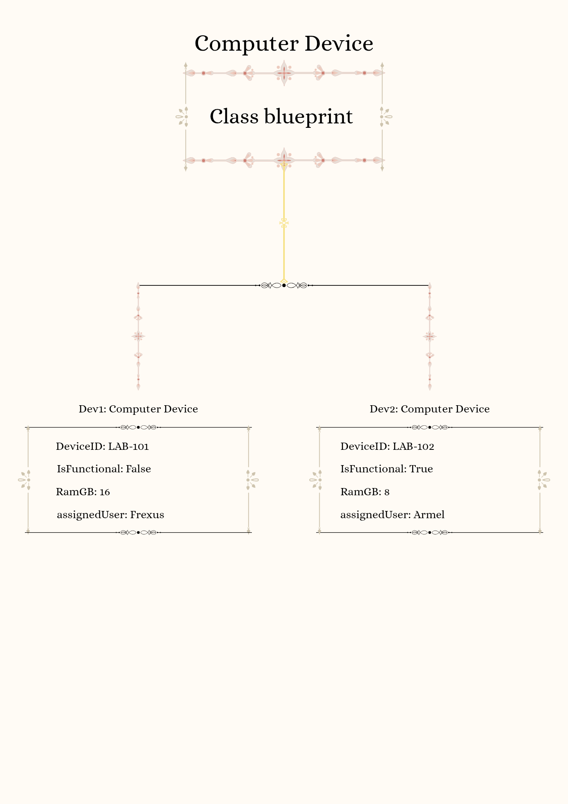

# Class Attributes and Methods

## Previous Design
Link to my previous activity: [classObjectUML.md](classObjectUML.md)

## Design Revision
No major structural changes were made to the attributes or methods. The visibility modifier for `assignedUser` was set to private to ensure data encapsulation, while other properties remain public

## Visibility Decisions

| Attribute | Data Type | Visibility | Reason |
| --- | --- | --- | --- |
| `deviceID` | `string` | Public | Necessary for general system lookup and asset tracking across the organization. |
| `isFunctional` | `boolean` | Public | System operators need quick visibility into operational readiness. |
| `ramGB` | `int` | Public | System specifications are public metadata required for resource allocation. |
| `assignedUser` | `string` | Private | Sensitive user association data that must only be updated via strict validation methods. |

## Updated UML Class Diagram

## Python Implementation
[View Python Source](classImplementation.py)

## Test Run

## Object Diagram

## Analysis 

### Why did you make your chosen attribute private?

The assignedUser attribute was made private to safeguard user privacy and enforce data validation and allowing external code to directly modify who is assigned to a device could lead to unauthorized reassignments

### Which method changes the state of your object?

The assignUser(userName) method changes the assignedUser attribute, and reportIssue() changes the isFunctional attribute

### How did your two objects demonstrate that instances are independent?

When assignUser("Charlie") and reportIssue() were called strictly on dev1, its assignedUser updated to "Charlie" and its status became non-functional and dev2 maintained its original state (assignedUser = "Armel", isFunctional = True)

### What is the difference between your class diagram and your object diagram?

The class diagram serves as a blueprint showing general data types and available methods the object diagram represents specific instances in memory at a specific snapshot in time, displaying actual runtime values rather than variable declarations
