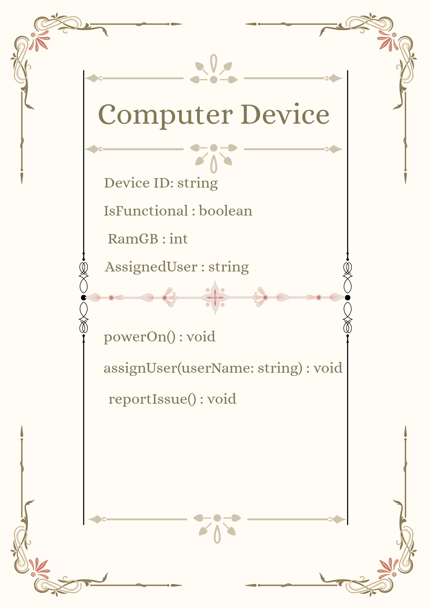

# SG4 - Understanding Classes and Objects

## Class Name
'Computer Device'

## Class Description
Represents a physical computer workstation device managed within a computer laboratory system. It tracks the hardware specifications, operational status and assignment details of a desktop or laptop unit

## Properties
| Property | Data Type | Description |
|---|---|---|
| DeviceID | string | Unique identifier assigned to the computer unit |
| IsFunctional | boolean | Indicates if the computer is fully/completely operational or needs repair |
| RamGB | int | Amount of RAM installed in the unit in GB(gigabytes) |
| AssignedUser | string | Name or ID of the student currently logged in |

## Methods
| Method | Description |
|---|---|
| PowerOn() | boots up the system and readies it for system use |
| AssignedUser(UserName: string) | Assigns a specific student or user to the computer session |
| reportIssue() | Flags the computer unit as non-functional or for administrative maintenance |

## Class Diagram

## Design Explanation

### Why did you choose this class?
I chose 'Computer Device' because management of hardware assets in a school computer laboratory is a fundamental rea world application. Tracking individual machines help maintain order, monitor maintenance needs, and manage user allocations during classes.

### Which property is the most important? Why?
The 'deviceID' property is the most important because it acts as the primary key that uniquely identifies each unit in the tab because without a unique ID it would be impossible to track

### Which method is the most useful? Why?
The 'assignUser(userName: string)' method is the most useful because it allows dynamically taking in a parameter to associate individual students with specific equipment
